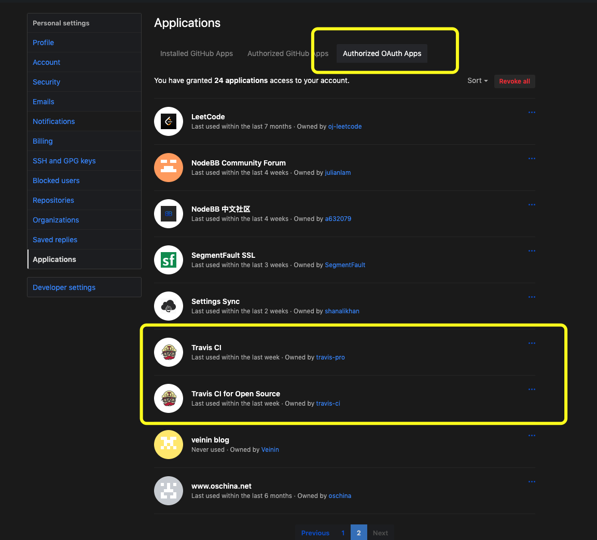
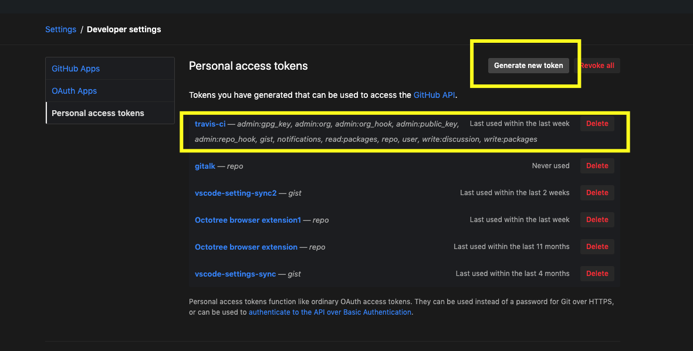
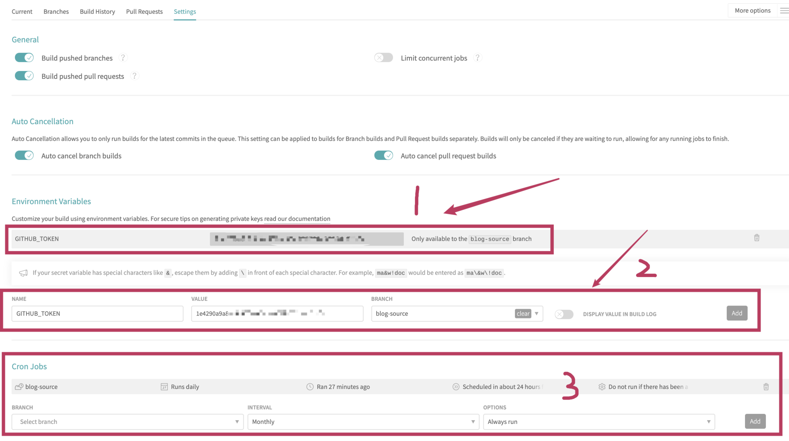
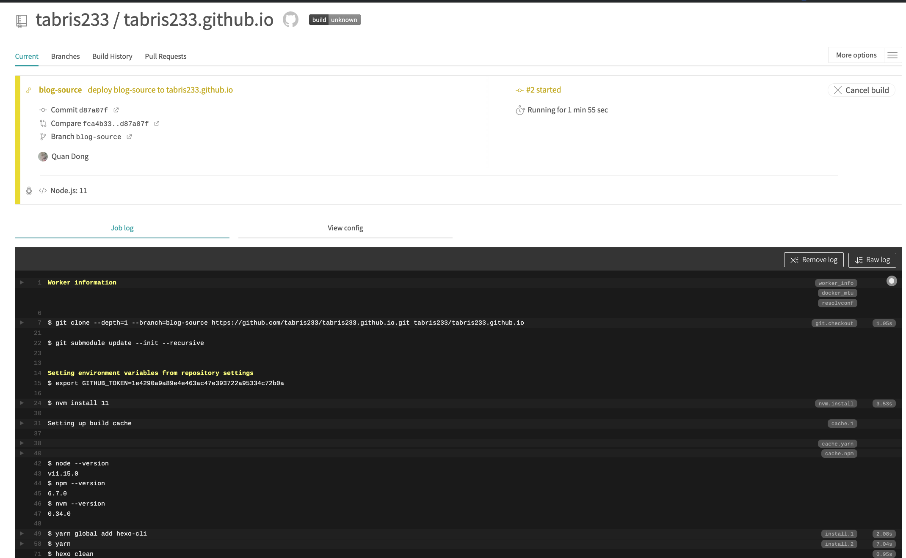

# travis-ci 自动化部署hexo静态博客

> 使用github pages的用户应该都有一个痛点, 就是要本地写好博文后再执行`hexo c`,`hexo g`,`hexo d`等命令, 特别是当博文数量多了的时候`hexo g`就要等待几分钟甚至更长时间,然后在`hexo d` 甚是烦恼.
>
> 查了资料, 有了`travis-ci`这个`GitHub` 的亲兄弟,就容易的多了, 只需`3`步配置,就可以享受持续集成自动部署博客的. 
>
> 用户只需要在`markdown`原文上修改,然后`push`到`github`上去就可以了,

## Step 1 GitHub 上配置

1. 安装`github\ app`

    https://github.com/settings/installations

    

2. 申请`Personal\ access\ tokens`

    转送门 -> https://github.com/settings/tokens

    在这里主要是设置`github-token`,让`travis`有权限读写`github`项目文件

    去`github`上申请一个就好

    点`生产新的token`的按钮.申请好后就会出现下面的那个.

    

    我勾选的设置,可以参考

    

## Step 2 配置travis-ci

1. 在<https://travis-ci.org>配置项目

    > 注意私有项目需要用<https://travis-ci.com> 这个是需要费用的.

    用`github`账号登录<https://travis-ci.org>, 在右上角头像出现下拉框里面选择设置,

    然后找你博客源码所在项目, (我的项目放在`tabris233.github.io`的`blog-source`分支下,所以勾选这个项目,然后点后面的`Settings`)

    

    先在`2`上添加`github-token`值用刚刚申请好的哪一个, 后面在构建日志中展示值得选项可勾可不勾. 然后点`add`,  然后就会出现在`1`的位置.

    Ps: `3` 是个定时构建, 看个人心情, 随意了.

    

2. 要在项目根目录建立`.travis.yml`文件

    > 其实这个配置文件写的比较烂, <https://travis-ci.org>对`github\ pages`有一个专门的配置`yaml`,
    >
    > 我这个算是专门配置加原始配置杂交出来的....
    >
    > 最后三行感觉没啥用,但是没有就是不行....

```yaml
language: node_js   # 指定运行环境

node_js: '11'       # node环境的版本

branches:           # 该shell脚本只对github的blog-source分支生效
  only: 
    - t'tblog-source

git:                 # 克隆github上的项目到travis
  quite: true        # 为了不打印一些日志，故设为安静克隆
  depth: 1           # 只克隆最新的一次commit提交，最多可以克隆最新的30次提交，但是没必要
  submodules: true   # 不克隆子项目(避免再次克隆hexo主题)

cache: yarn          # 缓存yarn命令也就是yarn add命令执行后的目录文件，即node_modules

install: 
  - yarn global add hexo-cli # 在安装阶段，运行yarn命令来安装依赖
  - yarn

script:
  - hexo clean
  - hexo generate

deploy:              # 发布阶段
  provider: pages    # 解析支持者为github pages
  skip_cleanup: true # 必须打开，如果在travis构建期间你正在推代码，很可能误删你最新的上传代码
  github_token: $GITHUB_TOKEN  # 在travis的环境变量获取授权码，表示travis有权对github的项目进行拉取推送操作
  keep_history: true # 禁止travis对你的github项目进行强制推送 
  repo: tabris233/tabris233.github.io
  target-branch: master # 你推送到哪个分支.
  fqdn: tabris.top
  local_dir: ./public
  email: tabris.dq@qq.com
  name: tabris
  project_name: tabris_blog_travis-ci
  on:                 # 这个静态文件来自travis中的master分支
    branch: matery
    all_branches: true
```


## Step 3

修改博文`markdown` 然后`push`上去就行了. 会看到这样的界面

包含构建日志什么的,最后会部署到`github\ pages`的`master`分支上

